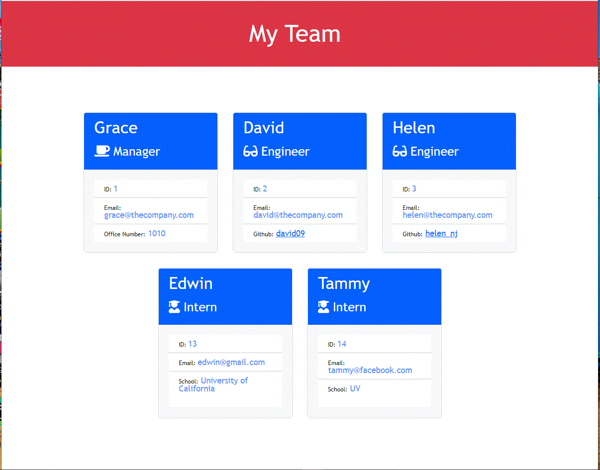

# Team Profile Generator
   
 build a Node.js command-line application that takes in information about employees on a software engineering team, then generates an HTML webpage that displays summaries for each person and a unit test for every part of code and ensure that it passes each test using Javascript, Node.js, OOP

## Features

1. A manager generates a webpage that displays my team's basic info to access to their emails and GitHub profiles
2. a command-line application that accepts team member's user input : name, email, github
3. Email : open my default email application with email address 
4. Github : open new tab 
5. the team manager’s name, employee ID, email address, and office number
6. presented with a menu with the option to add an engineer or an intern or to finish building my team
7. select the engineer option :  the engineer’s name, ID, email, and GitHub username,  and go to the menu
8. select the intern option :  the intern’s name, ID, email, and school, and go back to the menu
9.  decide to finish building my team 
10.  exit the application, and the HTML is generated  [index.html](https://klhi3.github.io/github-team-profile-generator/)


Directory: 

```md
__tests__/			// jest tests
  Employee.test.js
  Engineer.test.js
  Intern.test.js
  Manager.test.js
dist/               // rendered output (HTML) and CSS style sheet
lib/				// classes
src/				// template helper code
index.js			// runs the application
```


## Run

run following command: 

```bash
node index.js
? What is Manager's name? Grace
? What is Manager's id? 1
? What is Manager's email? grace@thecompany.com
? What is Manager's office number? 1010

>>>>>>> add Employee to the team:
? Add a team member's role (Use arrow keys)
> Engineer
  Intern

>>>>>>> add Employee to the team:
? Add a team member's role Engineer
? What is employee's name? David
? What is employee's id? 2
? What is employee's email? david@thecompany.com
? What is engineer's github username? david09
? Would you like to add more team member? Yes

>>>>>>>> Successfully created index.html!

```
  
## Portfolio

* run in terminal <br>


* index.html created<br>



## links
* [Jest](https://www.npmjs.com/package/jest) for running the unit tests
* [Inquirer](https://www.npmjs.com/package/inquirer) for collecting input from the user

  
   

:copyright:klhi3


